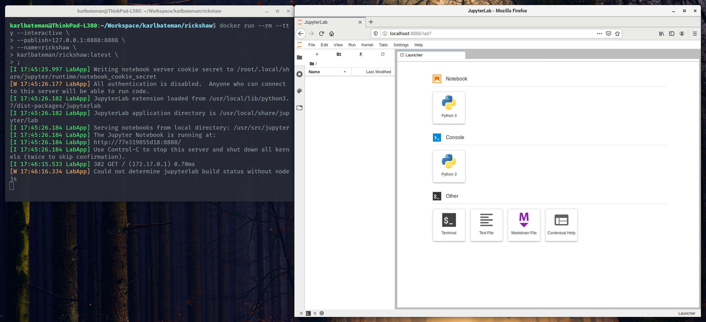

# Rickshaw

> An unofficial Docker version of Jupyter

## Introduction

[Jupyter](https://jupyter.org) is an online data science environment. Rickshaw is a Docker version of
Jupyter which includes a collection of popular data science [Python](https://www.python.org/)
libraries which simplifies setup and deployment.



## Getting Started

Before you proceed with usage examples, please ensure you have [Docker](https://docker.com)
installed on your system.

### Usage

Run either of the following commands to launch a local instance, depending on your needs.

```bash
docker run --rm --tty --interactive \
  --publish=127.0.0.1:8888:8888 \
  --name=rickshaw \
  karlbateman/rickshaw \
  ;
```

For mounting a persisted volume, please use the following command.

```bash
docker run --rm --tty --interactive \
  --publish=127.0.0.1:8888:8888 \
  --name=rickshaw \
  --volume=~/.data/notebooks:/usr/src/app \
  karlbateman/rickshaw \
  ;
```

Visit <http://localhost:8888> in your web browser.

## Packages

The following packages have been bundled with this environment for convenience:

### Utilities

* [Requests](http://docs.python-requests.org/en/) - A HTTP request package
* [BeautifulSoup](https://www.crummy.com/software/BeautifulSoup/bs4/doc/) - We called him Tortoise because he taught us
* [DeepDiff](https://deepdiff.readthedocs.io/en/latest/) - Python data type delta library

### Data

* [Pandas](https://pandas.pydata.org/) - Data analysis package
* [Scipy](https://www.scipy.org/) - Mathematics, science and engineering package
* [Numpy](http://www.numpy.org/) - Scientific computing package

### Machine Learning

* [Scikit-Learn](https://scikit-learn.org/) - Machine learning package

### Natural Language Processing

* [LangDetect](https://github.com/Mimino666/langdetect) - Port of Google's language detection library
* [Spacy](https://spacy.io/) - Industrial-Strength Natural Language Processing

### Database Tools

* [SQLAlchemy](https://www.sqlalchemy.org/) - SQL toolkit and ORM

### Visualisation

* [Matplotlib](https://matplotlib.org/) - 2D plotting library

## Available Kernels

The following kernels have been configured to work with this Jupyter configuration.

| Kernel      | Version | Ref                                                         |
| ---         | ---     | ---                                                         |
| Python      | 3.8     | [www.python.org](https://www.python.org/)                   |

## License

[BSD](LICENSE) © [@karlbateman](https://github.com/karlbateman)
